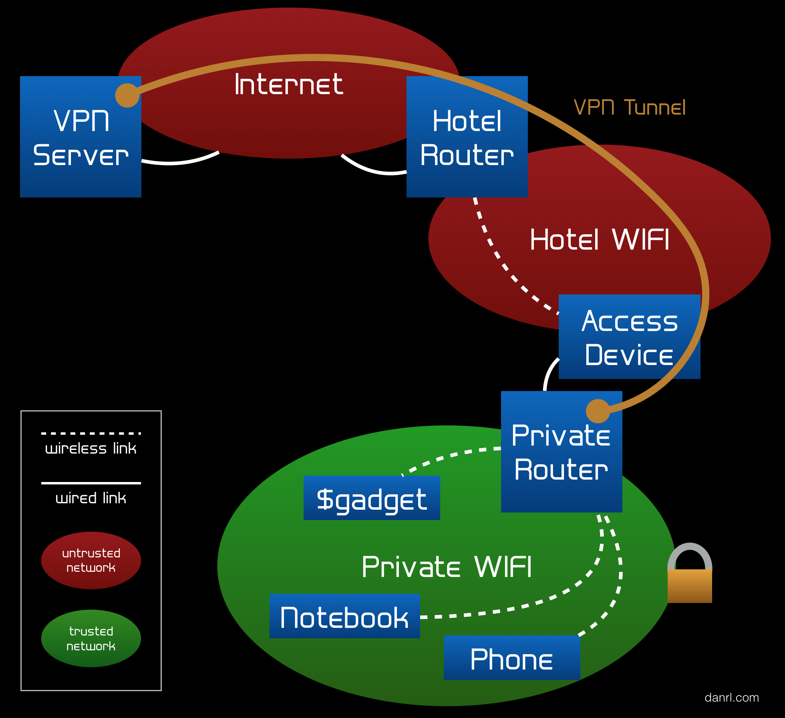

### Welcome to Secure Webb

I created Secure Webb so that my family and friends can use the internet securely and without your personal browser data being collected.

## The main benefits:

- Use any public WiFi completely securely.
- Secure Webb stops app's and websites from tracking you.
- No Ad’s on websites or in app’s.
- Faster internet browsing

If you use Secure Webb and Signal for your messaging and call's you will have an encrypted comms solution that would make [El Chapo proud](https://www.nytimes.com/2019/01/08/nyregion/el-chapo-trial.html).

## How does it work?

- You connect to my ultra secure VPN through the WireGuard app
- All your internet traffic is encrypted and routed through a Virtual Private Server (VPS) in the cloud
- The VPS then sends your DNS requests to our DNS sinkhole which strips out all tracking and Ad requests.
- The DNS sinkhole sends the approved requests to our DNS server which in turn passes these requests onto the internet’s root DNS servers, this is important because it means ISP’s or others can’t track you through their own cached DNS servers.
- Once the DNS process finishes a request is made to the website you’re browsing from the VPS, encrypted and sent back securely to your device

## If you would like to try it out please [Register Here](register.html)
